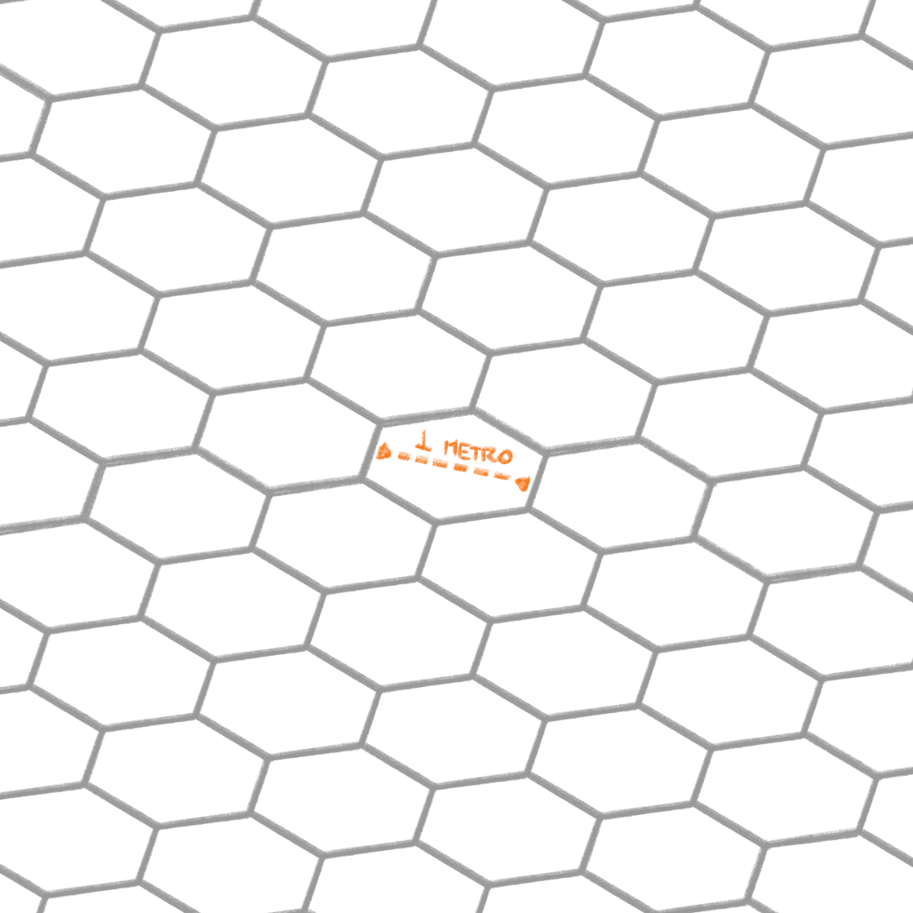
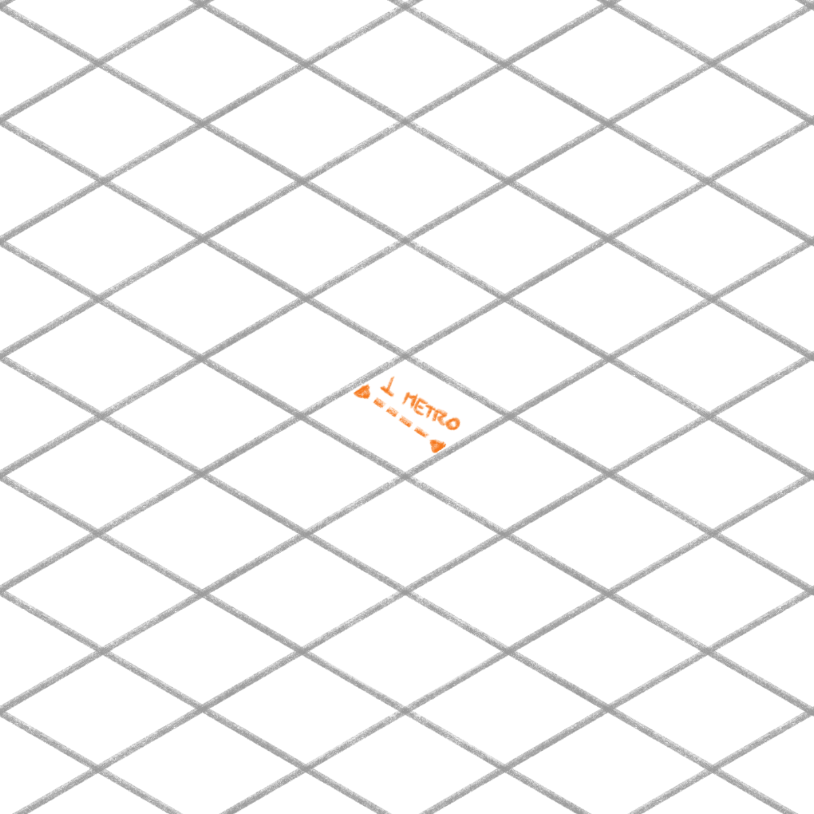
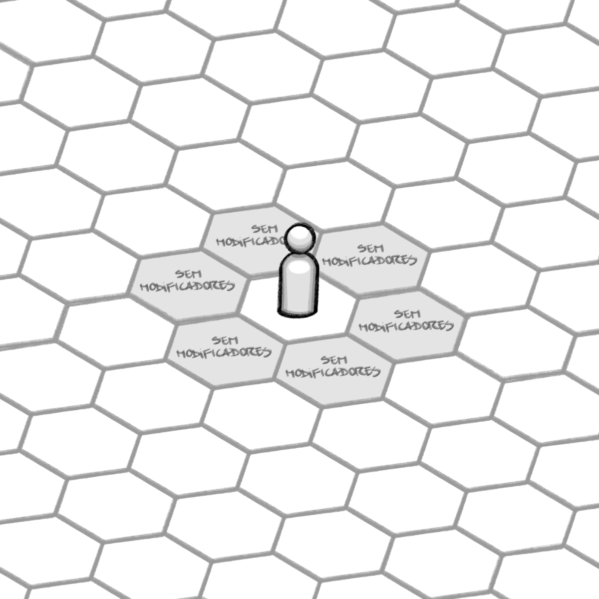
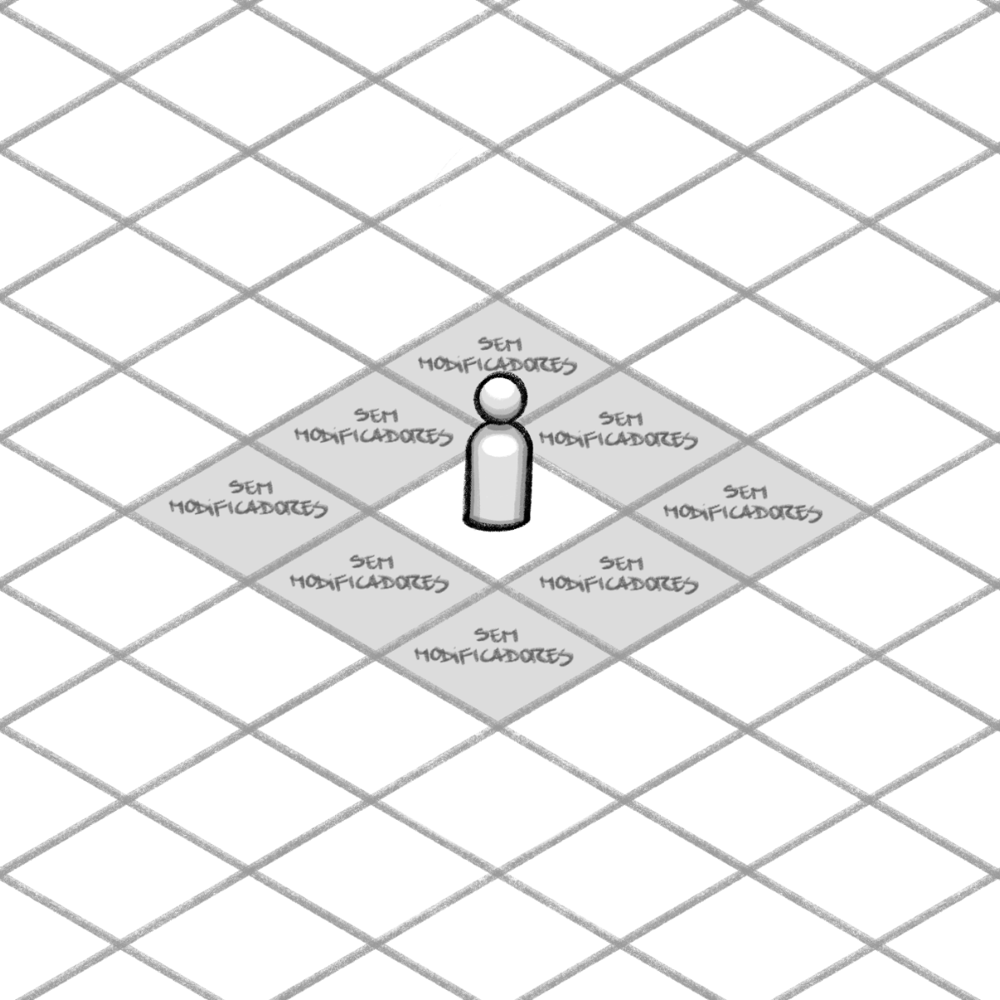
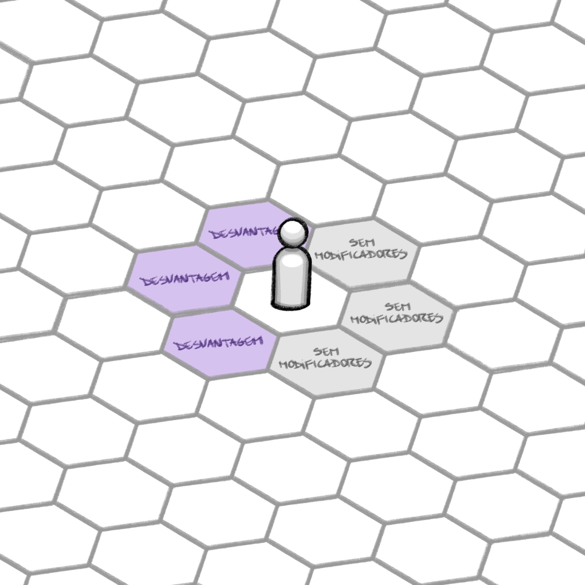
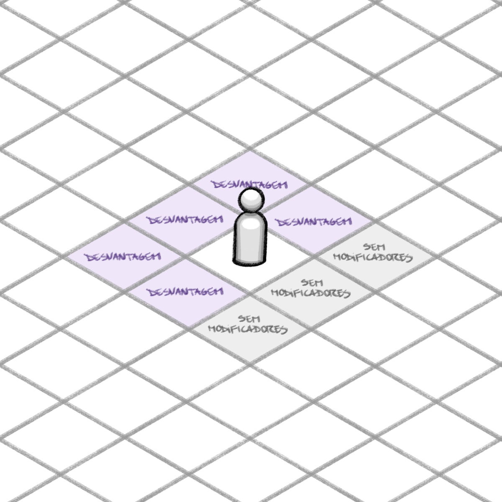
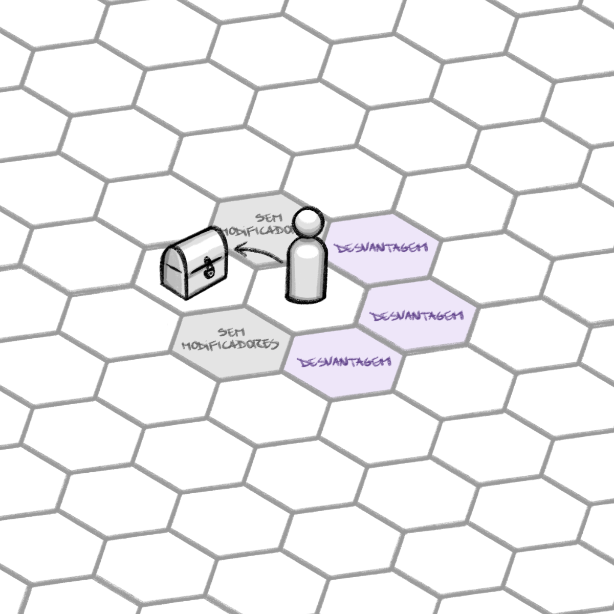
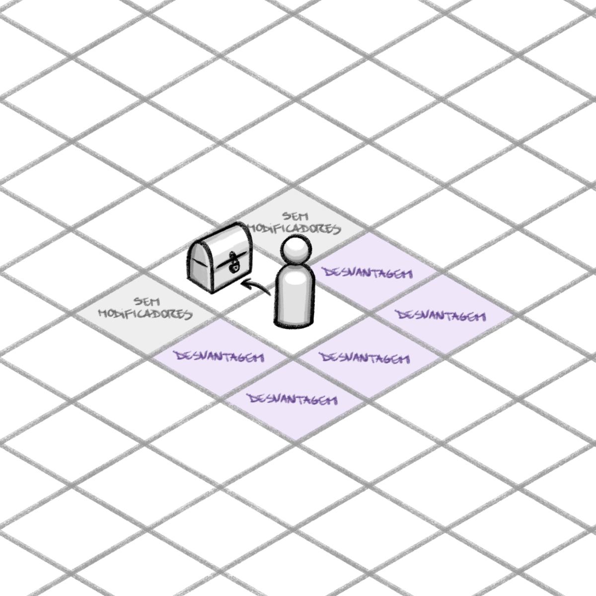
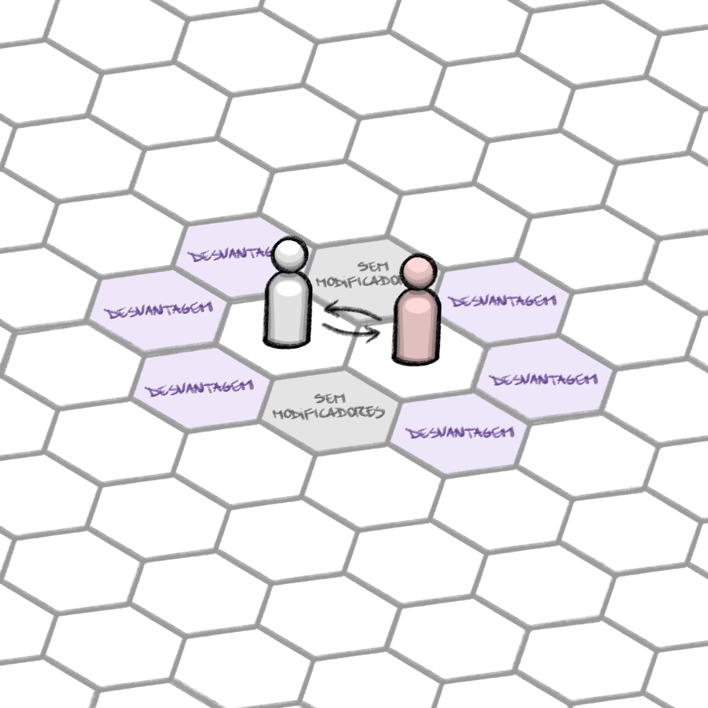
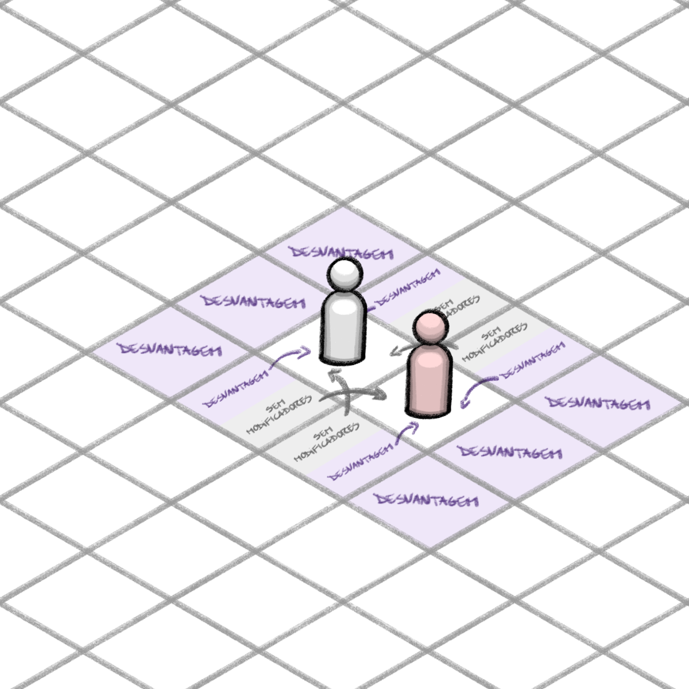

---
titulo: Conflito físico
tipo: regra
cenario: base
status: estavel
tags: [conflito, combate, iniciativa, malha, posicionamento]
atualizado-em: 2026-07-11
---

# Conflito físico

Durante um jogo **o narrador pode decretar o início de um conflito** (ou combate), seja pela ação de um jogador ou por consequência de uma ação (ou reação) de um personagem do narrador (NPC). Um conflito pode ser uma luta de espadas, uma complexa invasão de trincheiras, uma corrida de carros, ou qualquer outro evento em que dois ou mais personagens colocam suas habilidades e estratégias em teste, se movimentando pelo terreno, para atingir determinado objetivo.

Um conflito acaba quando um dos adversários (ou conjunto de adversários) se rende, foge, é nocauteado, invalidado, morto em combate ou quando o narrador decretar o fim do conflito por outros fatores.

## Iniciativa de conflito físico

Os conflitos funcionam em um sistema de turnos. Chamamos de “**turno**” o período de tempo que compreende as ações de um único personagem. Já uma “**rodada**” é o período que compreende os turnos de todos os personagens envolvidos no conflito.

Cada vez que um conflito se inicia, tanto personagens de jogadores como NPCs precisam definir sua **INICIATIVA**, ou seja, a sequência em que farão suas ações.

Para isso, jogadores e narrador jogam **`1d10`**. Jogadores podem aplicar aptidões de qualquer atributo para rerrolar esse dado.

**Especificamente para iniciativa, o resultado final será a soma de todos os dados jogados pelo jogador.** Então os personagens são ordenados dos que obtiveram maior resultado até o menor.

### Empates em iniciativa

- Para caso de personagens com valores iguais de iniciativa, **os jogadores sempre jogam primeiro do que NPCs** e inimigos na lista de iniciativa.
- Para o caso de dois jogadores com valores iguais, **o jogador que rolou mais dados para iniciativa fica à frente** na lista.
- Caso o mesmo número de dados tenha sido rolado, **ambos jogam `1d10` novamente** (até que tirem valores diferentes) e **o jogador com o maior número ficará à frente** na lista de iniciativa.

## Malha de combate físico

Para representar os combates que ocorrem na imaginação do narrador e dos jogadores, o Marca de Sangue utiliza uma **malha de combate físico** em que os **espaços** equivalem a 1 metro de distância. Recomenda-se o uso da malha hexagonal, que dará mais possibilidades estratégicas ao jogo, mas também é possível utilizar a malha quadrada, comum também a outros jogos de RPG.

*Malha Hexagonal*

*Malha Quadriculada*

Neste sistema, o alcance das armas também é medido em metros. Toda arma tem um **alcance ideal** (valor ou faixa), em que ataca normalmente, e um **alcance não ideal**, em que ainda pode tentar acertar, mas com **`desvantagem`** — a regra completa está em [Equipamentos — Alcance ideal e alcance não ideal](../listas/equipamentos-base.md#alcance-ideal-e-alcance-não-ideal).

> *Exemplo: Se uma lança longa tem 2 metros de alcance ideal, em uma malha hexagonal, isso significa que o personagem que a está utilizando consegue golpear qualquer oponente a 2 espaços de distância.*

Em uma malha quadrada, para mensurar a distância de uma forma simples, mesmo que para fins de alcance de uma arma, basta contar os “espaços” até lá, sempre passando de um espaço a outro pelos lados e nunca pelas diagonais.

## Posicionamento em campo

Quando estiverem em um conflito, a direção a que o personagem está voltado pode fazer muita diferença. O posicionamento representa a direção a que o personagem direciona a parte frontal de seu corpo e sua atenção de modo a atacar ou se defender. O jogo trabalha **somente com o posicionamento definido**: espera-se que todo personagem termine o próprio turno com frente e costas definidas. **Definir o posicionamento não gasta ação** (nem `PA`): é apenas uma indicação, feita normalmente ao fim do turno. Isso determinará que modificadores relacionados a posicionamento podem ser aplicados.

> 💡 **Na mesa:** com miniaturas ou tokens, use o próprio formato da peça ou uma marcação (por exemplo, uma seta ou um ponto na base) para indicar a frente do personagem.

> ✅ Decidido em 11/07/2026: o posicionamento aberto deixa de ser uma escolha do jogador (ver [notas-de-design/decisoes/2026-07-11-reunioes-de-mecanica.md](../../notas-de-design/decisoes/2026-07-11-reunioes-de-mecanica.md)); clarificações de custo, definição por contexto e modificadores exatos em [notas-de-design/decisoes/2026-07-11-reacao-posicionamento-propriedades.md](../../notas-de-design/decisoes/2026-07-11-reacao-posicionamento-propriedades.md).

### Posicionamento aberto (penalidade de esquecimento)

O posicionamento aberto **deixa de ser uma escolha do jogador**. Um personagem só fica em aberto quando **nada óbvio definiu seu posicionamento** até o fim do próprio turno — e isso é tratado como **penalidade de esquecimento, nunca como escolha**: nenhum de seus lados é considerado frente ou costas e ele recebe **`desvantagem`** para se defender de ataques vindos de **qualquer direção**, até que seu posicionamento seja definido.

O mesmo vale para **NPCs**: o narrador define o posicionamento deles; se esquecer e não houver indicação plausível no contexto, o NPC fica **aberto**, com a mesma desvantagem.

*Posicionamento aberto (em malha hexagonal)*

*Posicionamento aberto (em malha quadriculada)*

> 💡 **Definição por contexto (sem custo)**
>
> Antes de deixar um personagem em aberto, o narrador aplica o bom senso — o contexto define o posicionamento automaticamente, sem custo algum:
>
> - quem **atacou** fica voltado para a **última pessoa que atacou**;
> - quem **foi atacado pode escolher** virar-se para **quem o atacou**, ao receber um ataque vindo daquela direção — desviando ou não.
>
> A penalidade vale para o esquecimento genuíno, não para prejudicar o jogador cuja direção era óbvia.

### Posicionamento Definido

Ao transitar para um posicionamento **Definido**, o personagem decreta momentaneamente a posição de sua frente e de suas costas, passando assim a receber modificadores de posicionamento até que seu posicionamento seja redefinido.

*Posicionamento definido (em malha hexagonal)*

*Posicionamento definido (em malha quadriculada)*

Um personagem entra em posicionamento **definido** voluntariamente quando:

- Declara seu posicionamento;
- Desfere um golpe corporal, tendo sua frente posicionada na direção do oponente;
- Interage com personagens, objetos ou outras coisas que necessitem concentração, permanecendo com posicionamento **definido** enquanto durar a interação;
- Levanta uma guarda, precisando indicar qual lado está guardando. Portanto, a **postura defensiva** é um tipo de posicionamento **definido.**

Um personagem entra em posicionamento **definido** involuntariamente quando:

- Recebe um golpe, tendo sua frente posicionada na direção do oponente.
    - Se o alvo optar por não defender o ataque, pode manter o posicionamento atual, mas recebe o dano sem chance de se esquivar.
    - Permanece com posicionamento **definido** até que desengaje do oponente ou seu posicionamento seja redefinido.
- É alvo de uma habilidade que força seu posicionamento definido.

*Posicionamento definido por interação (em malha hexagonal)*

*Posicionamento definido por interação (em malha quadriculada)*

> 💡 **Forçar Posicionamento**
> É possível forçar um posicionamento ao custo de **`2 PA`**, mas cuidado, ações de outros personagens podem modificar o seu posicionamento involuntariamente.

**Modificadores exatos de posicionamento:**

- **Atacado pelas costas:** o personagem atacado recebe **`desvantagem`** nos contratestes de esquiva, defesa ou outras reações cabíveis. **Não** confere **`vantagem`** ao atacante — na prática, atacar pelas costas continua favorecendo quem ataca: **flanquear é um objetivo do sistema**;
- **Atacado pela frente:** não concede vantagem de defesa por padrão. A vantagem para se defender pela frente vem de **levantar a guarda** (que também define o posicionamento — ver [Levantar guarda](02-acoes-em-conflito.md#levantar-guarda-entrar-em-postura-defensiva));
- **Aberto:** **`desvantagem`** para se defender de ataques vindos de **qualquer** direção (ver [Posicionamento aberto](#posicionamento-aberto-penalidade-de-esquecimento)).

*Posicionamento definido por engajamento (em malha hexagonal)*

*Posicionamento definido por engajamento (em malha quadriculada)*

No caso de estar utilizando a malha hexagonal, o personagem possui 3 espaços de frente e 3 de costas.

No caso de estar utilizando a malha quadrada, o personagem possui 3 espaços de frente e 5 de costas.

> 💡 **Cuidado!**
>
> Caso um personagem seja cercado com um inimigo em cada lado, o primeiro ataque forçará o posicionamento definido, ficando com as costas voltadas para o segundo inimigo. Ao levar um ataque do segundo inimigo, o personagem que está sendo atacado terá seu posicionamento redefinido. Ou seja: tome cuidado para não ser cercado, já que, nessa situação, após o primeiro ataque, você terá **`desvantagem`** no primeiro ataque de cada inimigo no turno dele.

### Engajamento

O engajamento é a zona de ataque de oportunidade das armas **corpo a corpo**, expressa em termos de **[alcance ideal](../listas/equipamentos-base.md#alcance-ideal-e-alcance-não-ideal)**. Um personagem está **engajado** quando ocupa um espaço dentro do alcance ideal da arma corpo a corpo de um oponente.

- **Gatilho padrão:** se um oponente **se move de um espaço dentro do alcance ideal da sua arma corpo a corpo para outro espaço ainda dentro do alcance ideal**, você pode usar a sua **[reação](02-acoes-em-conflito.md#reação)** para realizar um **[ataque de oportunidade](#ataque-de-oportunidade)**.
- **Não vale no alcance não ideal:** movimento que acontece no alcance não ideal da arma **não** ativa o ataque de oportunidade.
- **Propriedades expandem o engajamento** (os gatilhos se somam, não se substituem): armas **cortantes (`CORT.`)** também ativam o ataque de oportunidade quando o alvo **sai** do alcance ideal; armas **perfurantes (`PERF.`)**, quando o alvo **entra** nele (ver [Propriedades das armas](../listas/equipamentos-base.md#propriedades-das-armas)).
- **Ataques à distância não fazem ataque de oportunidade** — a não ser por traço específico, como o aspecto **[Vigilante](../listas/tracos-base.md#vigilante)**.

> ✅ Decidido em 11/07/2026: engajamento redefinido em termos de alcance ideal — a antiga "área de engajamento" deixa de ser usada como termo (ver [notas-de-design/decisoes/2026-07-11-terminologia-alcance-descanso.md](../../notas-de-design/decisoes/2026-07-11-terminologia-alcance-descanso.md), item A3).

> 💡 **Engajamento no posicionamento Definido**
>
> Enquanto o personagem estiver em posicionamento **Definido**, seu engajamento passa a valer apenas nos espaços do alcance ideal considerados frente.

### Ataque de Oportunidade

O ataque de oportunidade pode ser realizado caso um oponente se movimente de espaço a espaço dentro do alcance ideal da sua arma corpo a corpo (ver [Engajamento](#engajamento)). Ele é um caso da regra geral de **[Reação](02-acoes-em-conflito.md#reação)**: não custa `PA` — o jogador **consome a sua reação da rodada** e paga **pontos de [fadiga](../conceitos/08-fadiga.md) iguais ao custo em `PA` da ação realizada**. Reagir é opcional: pode-se escolher não reagir para não gastar fadiga. Descrição completa em [Ações possíveis em um conflito](02-acoes-em-conflito.md#ataque-de-oportunidade).

### Flanqueamento

Se um personagem for flanqueado, ou seja, estiver dentro do alcance ideal das armas corpo a corpo de dois oponentes, e não for capaz de se afastar em seu turno sem se movimentar dentro do alcance ideal deles, no ato de movimentar-se poderá receber um ataque de oportunidade de pelo menos um oponente que estiver engajado com ele. A menos que possua alguma habilidade que o permita negar os ataques.

## Condições de ambiente e terreno

As condições de **ambiente e terreno** não são específicas de batalha: valem para qualquer cena e são **contextuais** — quem avalia se a condição afeta a ação é o **narrador**, olhando o contexto. A mesma condição pode atrapalhar uma ação e ser irrelevante para outra: a escuridão atrapalha achar o caminho ou interagir com o que está ao redor, mas não atrapalha ponderar.

Uma condição pode gerar **dois tipos de efeito, que podem coexistir** na mesma situação:

1. **`Vantagem`** ou **`desvantagem`** no teste ou no contrateste;
2. **Efeitos mecânicos próprios** — ex.: **terreno difícil** (ladeira, lama, água funda) **dobra o custo de `PA` do deslocamento**.

> *Exemplos de coexistência: avançar com água na cintura contra a correnteza = custo de deslocamento dobrado **+** teste físico para não ser arrastado; uma escalada íngreme = custo dobrado **+** teste com desvantagem para quem não tem a [técnica](../conceitos/06-tracos.md) de escalada.*

> ✅ Decidido em 11/07/2026 (ver [notas-de-design/decisoes/2026-07-11-revisao-testes-aptidoes-fadiga.md](../../notas-de-design/decisoes/2026-07-11-revisao-testes-aptidoes-fadiga.md)).

Situações comuns que costumam gerar esses modificadores:

> 💡 PROPOSTA (IA) — lista inicial de exemplos, revisar:

- Terreno difícil ou instável;
- Escuridão ou visibilidade reduzida;
- Lutar dentro d'água;
- Chuva forte ou vento;
- Alvo em cobertura;
- Calor ou frio extremos;
- Superfície escorregadia.

O detalhamento completo dessas condições virá no **Manual base do narrador** (ver [PLANO-DE-MELHORIAS.md](../../PLANO-DE-MELHORIAS.md), Lote 5).

### Elevação

Diferença de altura entre atacante e alvo só conta como **elevação** a partir de **1 metro** — abaixo disso, é como se os dois estivessem no mesmo nível. Havendo elevação:

- **Ataques à distância de cima para baixo** são feitos com **`vantagem`**;
- **Ataques corpo a corpo de cima para baixo** são **normais** (sem vantagem);
- **Quem está abaixo ataca quem está acima com `desvantagem`** (qualquer ataque);
- **O alcance continua valendo:** uma arma corpo a corpo com 1 metro de alcance não atinge um alvo 1 metro acima — o narrador arbitra pela cena se o ataque é possível.

O racional: superioridade visual e gravidade favorecem quem está no alto; quem está embaixo já paga `PA` para subir e ainda luta contra a posição.

> ✅ Decidido em 11/07/2026 (ver [notas-de-design/decisoes/2026-07-11-revisao-testes-aptidoes-fadiga.md](../../notas-de-design/decisoes/2026-07-11-revisao-testes-aptidoes-fadiga.md)). Movido de "Testes e contratestes" para cá em 11/07/2026, por decisão do grupo.

## Sequência de ações em um combate

Para que um combate ocorra da melhor forma sem que faltem informações aos jogadores, os ataques e defesas/esquivas seguem uma sequência de ações e acontecimentos:

1. Ao iniciar uma jogada de ataque o jogador anuncia se realizará um ataque descuidado ou mirado.
    1. No ataque mirado: anuncia qual parte do corpo pretende acertar;
2. O narrador e os jogadores indicam quais modificadores serão aplicados à ação;
3. O atacante joga o **`d10`** de teste de acerto, aplicando-se os modificadores;
4. O alvo pode realizar um contrateste de esquiva ou contrateste de desempenho de defesa (ou alguma outra reação simples e diretamente relacionada ao teste), aplicam-se os modificadores.
    1. Se o valor final do teste do atacante for maior do que o valor final do contrateste do oponente, é considerado um acerto.
    2. Se o resultado for menor ou igual o valor final de contrateste do oponente, é considerado um erro.
5. Uma vez atingido o alvo, o atacante joga os dados de dano de acordo com a arma ou habilidade que está utilizando.
6. Os valores de redutor de dano da armadura ou habilidade do oponente são subtraídos do valor de dano do atacante — **sem nunca reduzir o dano abaixo de 1**: se o ataque acertou, o alvo sofre no mínimo 1 ponto de dano (ver [Saúde e Proteção](03-saude-e-protecao.md#redutor-de-dano-das-armaduras-dano-mínimo-1)).
7. O personagem acertado marca na ficha os pontos de dano recebidos pelo atacante.

> 💡 Não existe uma ordem certa para se utilizar ações de movimento em detrimento de outros tipos de ação. O jogador pode, por exemplo, andar, atacar e gastar o restante dos pontos de ação para se afastar do alvo.
