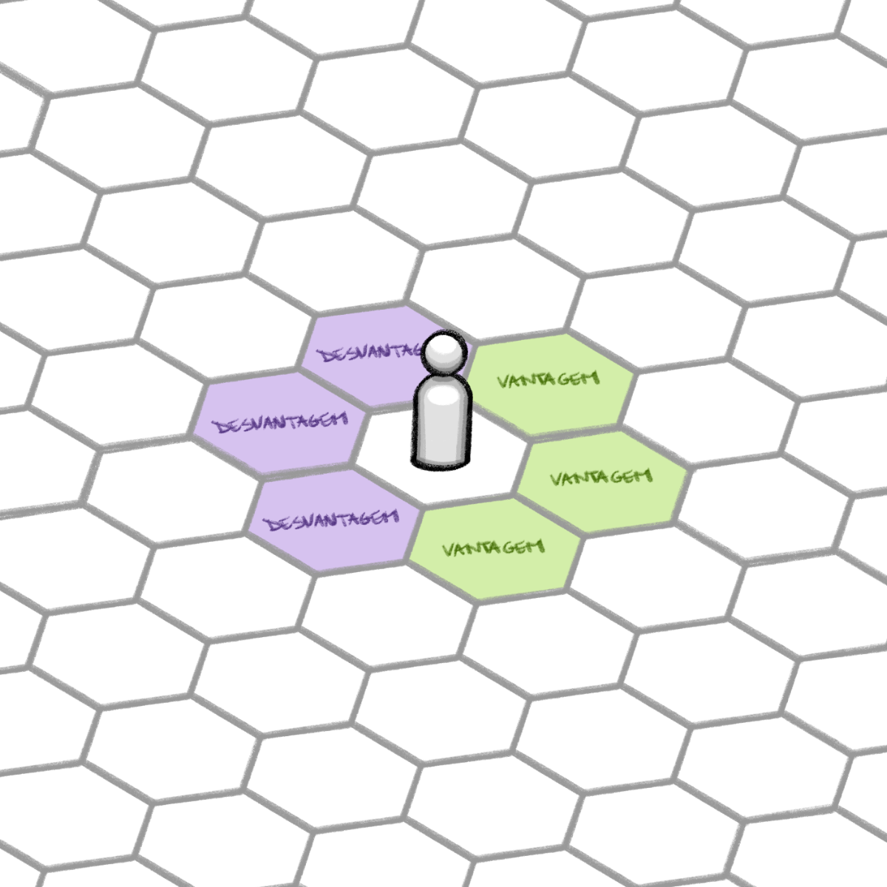
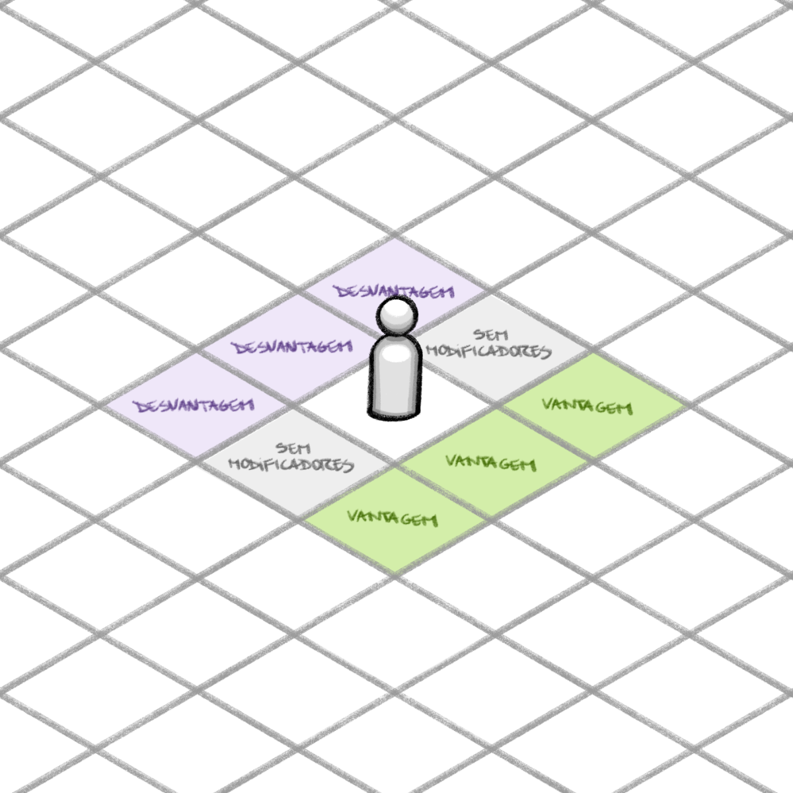

# Ações possíveis em um conflito

Durante um conflito, os personagens podem gastar pontos de ação para realizar as seguintes ações. Além das ações do turno, todo personagem tem direito a **1 [Reação](#reação) por rodada**, fora do seu turno — descrita ao final, depois de todas as ações.

## Ataque

Em seu turno, o jogador pode realizar quantos ataques quiser, gastando o número de pontos referente à arma, podendo usar habilidades e aptidões (consumindo seus respectivos usos) e aplicando traços cabíveis no ato:

- **Ataque desarmado: `1 PA`** por ataque
- **Ataque com arma leve: `2 PA`** por ataque
- **Ataque com arma média: `4 PA`** por ataque
- **Ataque com arma pesada: `6 PA`** por ataque

O custo é pelo **peso** da arma (igual para corpo a corpo e à distância). Em armas versáteis, a empunhadura muda apenas o dano, não o `PA` (ver [Equipamentos](../listas/equipamentos-base.md)).

### Ataque mirado

Ao realizar uma ação de ataque, o jogador deve indicar qual membro do adversário está sendo alvo da ação. **Braços e pernas são mais fáceis de acertar do que a cabeça e o tronco** (há desvantagem para tentar acertar esses membros, veja mais em [Saúde e Proteção](03-saude-e-protecao.md)). Quando bem planejado, invalidar um membro específico pode garantir grande vantagem estratégica no combate.

### Ataque descuidado

Se não indicar, por escolha ou por esquecimento, a que parte do corpo do adversário o ataque será direcionado, a ação é considerada um “ataque descuidado”. Ao realizar um ataque descuidado, o jogador rola o teste contra a defesa do adversário sem considerar a desvantagem para acerto da cabeça ou tronco. Se acertar o ataque, rola **`1d6`** para descobrir qual membro foi ferido.

Os valores do dado correspondem a:

| Resultado do `1d6` | Membro atingido |
|:---:|---|
| 1 | **Cabeça** |
| 2 | **Braço Direito** |
| 3 | **Perna Esquerda** |
| 4 | **Tronco** |
| 5 | **Braço Esquerdo** |
| 6 | **Perna Direita** |

> 💡 **Ataque indefinido**
>
> Caso o jogador se esqueça de indicar o membro alvo do ataque, o narrador pode considerar o ataque como descuidado e pedir ao jogador que role o dado para definir o local de acerto.

É importante lembrar que não existe “É óbvio que eu queria/iria mirar ali” ou “Eu só tenho mirado nesse membro até agora, claro que eu iria continuar mirando”.

Caso o jogador queira indicar uma preferência de membro por padrão, deve avisar ao narrador de forma clara antes de realizar as jogadas ou o narrador pode declarar o ataque como indefinido.

### Ataque com mão hábil

Ao criar seu personagem, você deve escolher qual é a mão hábil dele. O personagem precisa utilizar sua mão hábil para realizar um ataque em sua plena capacidade. Algumas habilidades têm como pré-requisito serem utilizadas com a mão hábil.

### Ataque com mão inábil

Um jogador pode realizar um ataque com a mão inábil, porém, recebe uma **`desvantagem`** e só pode causar metade do dano (arredondado para baixo). É possível transformar uma mão inábil em mão hábil comprando o traço específico.

### Ataque de oportunidade

Caso um inimigo **já esteja dentro do alcance ideal da sua arma corpo a corpo e se mova para outro espaço ainda dentro do alcance ideal**, você pode reivindicar um ataque de oportunidade (ver [Engajamento](01-conflito-fisico.md#engajamento) — o movimento no alcance não ideal não ativa o ataque). O ataque de oportunidade é um caso da regra geral de **[Reação](#reação)**: consome a sua reação da rodada e, em vez de custar `PA`, custa **pontos de [fadiga](../conceitos/08-fadiga.md) iguais ao custo em `PA` da ação realizada**. Como toda reação, é opcional — você pode escolher não reagir para não gastar fadiga.

O ataque de oportunidade deve consistir em um ataque corporal simples, com o que o personagem estiver segurando naquele momento, ou um ataque desarmado.

Este ataque conta como um ataque descuidado e não possui vantagens ou desvantagens provenientes de posicionamento (o narrador pode aplicar vantagens e desvantagens de acordo com o contexto).

Efeitos gerados por aptidões também se aplicam a ataques de oportunidade.

> 💡 O ataque de oportunidade **consome a [reação](#reação)** do personagem. Como cada personagem tem, por padrão, **1 reação por rodada**, só é possível realizar **um ataque de oportunidade por rodada de combate** — a menos que um traço conceda reações extras ou o narrador indique o contrário.

> 💡 Armas à distância ou de arremesso não fazem ataque de oportunidade — a não ser por traço específico, como o aspecto [Vigilante](../listas/tracos-base.md#vigilante).

Habilidades ou ações mais complexas não podem ser feitas como ataque de oportunidade. Para isso é necessário que em seu turno o personagem ative um gatilho, ou seja, que gaste pontos de ação.

### Ataques consecutivos

Enquanto seu personagem ainda tiver pontos de ação disponíveis em seu turno, você pode usá-los para realizar novos ataques. Porém, penalidades podem ser aplicadas em determinadas situações.

**Ataques corporais consecutivos**

Após realizar o primeiro ataque em seu turno (acertando ou não) com uma arma corpo a corpo, o personagem **pode realizar novos ataques no mesmo oponente sem sofrer penalidades.**

Caso o personagem tente acertar outro oponente, seus ataques recebem **`+1d10 de desvantagem`** (acumulativo) até o fim do turno.

**Ataques consecutivos a distância ou de arremesso**

Após realizar o primeiro ataque em seu turno (acertando ou não) com uma arma à distância ou de arremesso, o personagem **pode realizar novos ataques em oponentes diferentes sem sofrer penalidades.**

Caso o personagem tente acertar o mesmo oponente duas vezes, seus ataques recebem **`+1d10 de desvantagem`** (acumulativo) até o fim do turno.

> 💡 **Trocar de arma após o primeiro ataque**
>
> Após realizar o primeiro ataque em seu turno, caso o personagem troque de arma por qualquer motivo, seus ataques seguintes recebem **`+1d10 de desvantagem`** (acumulativo) até o fim do turno.

## Interagir com itens, aparatos, objetos e pessoas

Ao usar um item, manipular um aparato ou interagir com objetos do mundo, o gasto de pontos varia de acordo com o nível de complexidade definido pelo narrador.

- **`1 PA`** **para atividades consideradas simples**, como pegar um objeto leve do chão, abrir uma porta destrancada e desobstruída ou dar as mãos a alguém;
- **`2 PA` para atividades consideradas normais**, como jogar um item para outra pessoa, destrancar um baú ou trancar uma porta.
- **`3 PA`** **para atividades consideradas complexas**, como escrever algo, subir por uma corda ou laçar um animal.

### Embainhar e sacar armas

Para embainhar uma arma que está utilizando em combate ou sacar uma arma que está embainhada, o jogador pode gastar **`1 PA`** por cada arma envolvida na atividade.

Exemplo: Se o jogador quer embainhar uma arma leve e sacar uma arma Pesada, no total ele gastará **`2 PA`**. Se quer embainhar uma arma leve e sacar outras duas armas leves, gasta **`3 PA`** no total.

### Falar em combate

Passar uma mensagem a outro personagem durante um combate é uma interação que tem características únicas. A complexidade dessa ação depende do número de palavras e do contexto do combate. Ao realizar essa ação, o narrador indicará quantas palavras serão ditas. Como referência para os narradores que vão utilizar esse sistema recomendamos a seguinte proporção:

- **4 palavras** por **`PA`** gasto.

O narrador escolhe se artigos, preposições e outras palavras curtas contam ou não. Mas essa decisão deve ser tomada antes das palavras serem ditas.

Os jogadores que estão recebendo a mensagem só podem responder em seus turnos usando a ação de falar em combate.

## Usar habilidades

O jogador pode usar habilidades para aumentar suas possibilidades de ações em combate. Elas podem se aliar às armas, armaduras e itens do personagem para trazer grandes vantagens. Mas fique atento que as habilidades usam um número próprio de pontos de ação e tem requisitos para que possam ser usadas. Seu personagem não poderia, por exemplo, usar uma habilidade relacionada à visão estando vendado. Todos os requisitos estão na descrição da habilidade.

Uma vez utilizada, a habilidade fica indisponível até que uma situação permita que você recupere sua capacidade de utilizá-la. Isso pode ocorrer, por exemplo, ao realizar um descanso ou ao ser alvo de alguma habilidade de recuperação.

**Atenção:** Usar uma habilidade não significa sucesso automático, a não ser que isso esteja escrito na descrição da habilidade. Na maioria das situações, ainda é preciso fazer **teste** e **contrateste**.

> 💡 **Registrando os usos na ficha**
>
> Ao utilizar uma habilidade descrita na ficha, você deverá **riscar os espaços correspondentes aos seus usos**. Ao recuperar suas habilidades, apague as marcações. **Os espaços sem marcação passam a estar disponíveis.**

## Movimentação

Apesar de ser possível utilizar os dois tipos de malha, o terreno dividido em quadrados apresenta algumas peculiaridades que não existem quando o terreno é dividido em hexágonos, por isso necessita de regras específicas.

Quando diz respeito a movimentação em uma malha hexagonal, todos os espaços adjacentes dividem lados inteiros com o espaço onde o personagem está. Assim, existem 6 opções de direção para seguir e o conceito de “andar na diagonal” não existe. Portanto, a regra geral de movimentação em terrenos hexagonais pode ser resumido como “cada espaço exige `1 PA` para movimentação e equivale a 1 metro”.

Já em uma malha quadriculada, além de dividir lados inteiros com outros 4 espaços, um determinado posicionamento tem pontos em comum com outros 4 espaços a partir de suas diagonais. Isso pode gerar confusão na cabeça dos jogadores. Para deixar o jogo mais simples e claro, em Marca de Sangue foram definidas as seguintes regras para malhas quadriculadas:

1. Deslocamento entre dois espaços que dividem 1 lado inteiro é considerado como 1 metro e custa 1 ponto de ação;
2. Deslocamento entre dois espaços que dividem somente um ponto, ou seja, movimento diagonal, custa 2 pontos de ação porque é considerado 2 metros.
    1. Pelo menos um dos espaços que dividem um lado nessa direção precisa estar desobstruído para que essa movimentação seja possível.

## Levantar guarda (Entrar em postura defensiva)

Durante um combate, o personagem pode usar pontos de ação para adotar uma postura de defesa que aprimora sua guarda. **A postura defensiva é uma variante do posicionamento definido, mas garante vantagem ao personagem em contratestes de esquiva ou defesa** para qualquer membro do corpo e também **impede que o oponente force um posicionamento definido** no personagem.

> 💡 **Quando não estiver engajado,** levantar a guarda custa **`2 PA`** por guarda levantada.

Um personagem em postura defensiva possui 3 espaços de costas com desvantagem e 3 espaços de frente com vantagem na malha hexagonal. Na malha quadriculada, o personagem em postura defensiva possui 3 espaços de frente com vantagem e 5 espaços de costas com desvantagem — os 2 espaços laterais são considerados costas na malha quadriculada.

*Postura defensiva (em malha hexagonal)*

*Postura defensiva (em malha quadriculada)*

Para isso, siga os passos:

1. Ao final do seu turno, o jogador poderá declarar quantas guardas irá acumular, gastando **`2 PA`** para cada espaço de guarda. O espaço de guarda serve tanto para se defender (com atributo Físico) quanto para se esquivar (com atributo Ágil).
    1. Se o jogador levantar uma guarda e depois se movimentar, essa guarda se perde, a menos que ele tenha alguma habilidade ou traço que diga o contrário.
2. Ao receber um ataque, o jogador pode optar por utilizar ou não um dos seus espaços de guarda adquirida em seu turno para aumentar suas chances de resistir ao ataque (se esquivando ou se defendendo).

> 💡 **Quando estiver engajado,** levantar a guarda custa **`3 PA`** por guarda levantada.

> 🧪 **Guarda + cobertura:** se o personagem estiver numa **cobertura** (muro, pedra, destroço), a guarda levantada também ativa os efeitos dela contra ataques à distância — ver [Cobertura](01-conflito-fisico.md#cobertura) (em teste).

## Atrasar turno

O jogador pode gastar pontos de ação em seu turno para atrasar sua posição na fila de iniciativa da batalha. Para cada ponto de ação utilizado, o jogador desce 1 posição na sequência de turnos, sendo que, independente de quantos pontos gastar para atrasar seu turno, quando chegar novamente a sua vez, ele poderá utilizar somente os **`PA`** restantes.

> **Exemplo:** em uma fila de 7 jogadores, respectivamente numerados, Luiz, que é o terceiro jogador, decide, em seu turno, gastar 2 dos seus 5 pontos de ação para atrasar sua posição na sequência de turnos em duas posições. Luiz pausa seu turno e os 2 próximos jogadores realizam suas ações, logo em seguida, Luiz realiza o restante de seu turno, no caso, ainda com 3 pontos de ação. Essa mudança na sequência de turno se mantém para as próximas rodadas, a não ser que Luiz ou outros jogadores voltem a usar ações para atrasar turnos.

> Caso Luiz utilize todos os seus pontos de ação para atrasar seu turno, ao chegar a vez de Luiz, considera-se que ele ainda está no mesmo turno, portanto, não possui nenhum ponto de ação restante para realizar qualquer atividade, mas para os próximos turnos, a posição de Luiz permanece com a nova configuração na sequência de turnos da batalha.

## Criar um gatilho

É possível gastar pontos de ação para programar gatilhos, que são ações que podem ser desencadeadas caso algo específico aconteça. Todo gatilho custa **`1 PA`** + **`PA`** da ação, arma ou habilidade programada. Caso a situação do gatilho não aconteça até o próximo turno do jogador, o personagem perde os pontos programados e o gatilho deixa de existir.

## Ações complexas

Algumas ações são mais difíceis de realizar do que aparentam, apesar de serem comuns. Todas essas ações podem ser realizadas por qualquer jogador, seja dentro ou fora de combate, porém joga-se um teste de desempenho para determinar se houve sucesso ou falha. Consulte a tabela de ações completas na lista “Ações disponíveis” na seção “Recursos básicos do sistema”.

## Reação

Além das ações pagas com `PA` no próprio turno, todo personagem tem, **fora do seu turno**, direito a **1 reação por rodada**. A reação é um recurso à parte: é recuperada no início de cada rodada e é controlada por um **marcador de reação na ficha**.

**A reação não custa `PA` — mas não é gratuita:** o custo em `PA` que a ação teria é pago em **pontos de [fadiga](../conceitos/08-fadiga.md)**, na razão de **1 ponto de fadiga por 1 `PA`** da ação realizada como reação.

> *Exemplo: uma reação de ataque com arma leve custa fadiga igual ao custo em `PA` do ataque com arma leve — `2 PA`, portanto **2 pontos de fadiga**.*

- Essa conversão (1 fadiga por 1 `PA`) é **mais barata** que comprar `PA` extras com fadiga no próprio turno (2 fadiga = 1 `PA`), mas **tem custo** — reagir desgasta o personagem;
- O personagem **pode escolher não reagir**, para não gastar fadiga;
- O **[ataque de oportunidade](#ataque-de-oportunidade)** é o caso clássico dessa regra: consome a reação da rodada e paga em fadiga o custo em `PA` da ação realizada;
- **Traços** poderão conceder **reações extras**;
- A reação **não** é necessária para contratestes (como esquiva e defesa), que continuam funcionando como descrito em [Testes e Contratestes](../conceitos/01-testes-e-contratestes.md).

> ✅ Reação como recurso por rodada decidida em 11/07/2026 (ver [notas-de-design/decisoes/2026-07-11-reunioes-de-mecanica.md](../../notas-de-design/decisoes/2026-07-11-reunioes-de-mecanica.md)); custo pago em fadiga e posição da seção após as ações decididos em 11/07/2026 (ver [notas-de-design/decisoes/2026-07-11-reacao-posicionamento-propriedades.md](../../notas-de-design/decisoes/2026-07-11-reacao-posicionamento-propriedades.md)).
